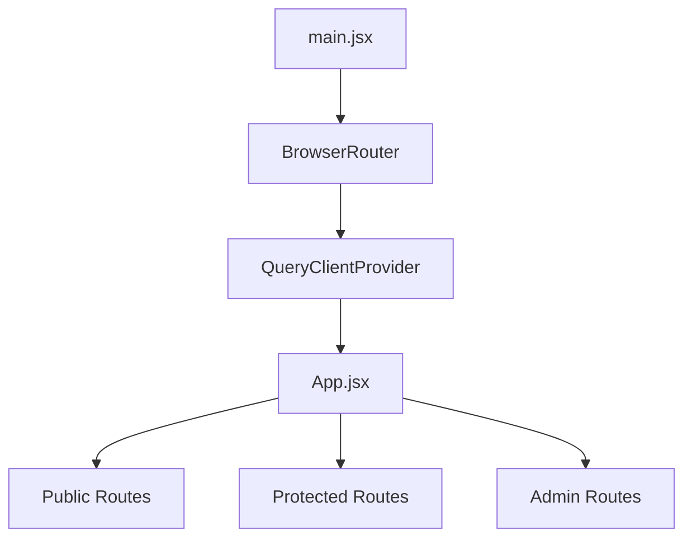
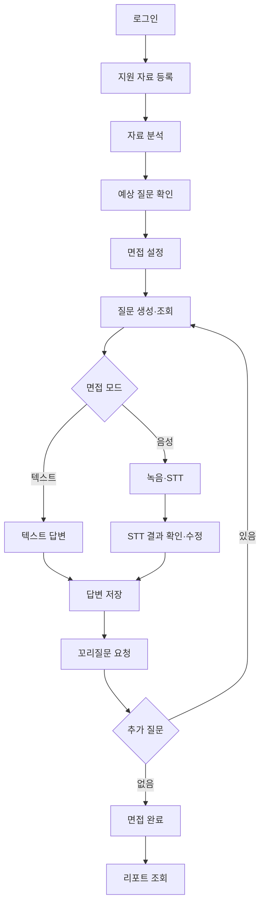
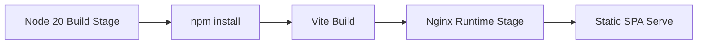

# CAREER.zip Frontend

<div align="center">

## React 기반 AI 모의면접 사용자·관리자 웹 애플리케이션

지원 자료 등록부터 AI 분석, 텍스트·음성 면접, 최종 리포트와 관리자 운영 화면까지  
CAREER.zip의 사용자 경험과 Backend API 연동을 담당합니다.

</div>

---

## 📚 목차

- [1. Frontend 개요](#1-frontend-개요)
- [2. 기술 스택](#2-기술-스택)
- [3. 애플리케이션 구조](#3-애플리케이션-구조)
- [4. 디렉터리 구조](#4-디렉터리-구조)
- [5. 라우팅 및 주요 페이지](#5-라우팅-및-주요-페이지)
- [6. 상태 관리와 데이터 흐름](#6-상태-관리와-데이터-흐름)
- [7. API 통신 및 인증](#7-api-통신-및-인증)
- [8. 주요 사용자 Flow](#8-주요-사용자-flow)
- [9. 음성 면접과 파일 업로드](#9-음성-면접과-파일-업로드)
- [10. 관리자 화면](#10-관리자-화면)
- [11. 환경변수](#11-환경변수)
- [12. 로컬 실행 및 테스트](#12-로컬-실행-및-테스트)
- [13. Build·Docker·배포](#13-builddocker배포)
- [14. 구현 범위와 주의사항](#14-구현-범위와-주의사항)

---

# 1. Frontend 개요

CAREER.zip Frontend는 React와 Vite 기반 SPA입니다.

## 담당 범위

- 회원가입, 로그인, 이메일 인증, OAuth Callback
- 사용자 온보딩과 프로필 관리
- JD, 이력서, 자기소개서, 프로젝트 등록
- 지원 자료 분석과 예상 질문 확인
- 면접 유형·페르소나·질문 수 설정
- 텍스트 및 음성 모의면접 진행
- STT 결과 확인·수정과 TTS 재생
- 꼬리질문 기반 면접 흐름
- 최종 리포트, 성장 추이, 로드맵 확인
- 공유 리포트 조회
- 마이페이지와 포인트 내역
- 관리자 대시보드, 회원, 포인트, 프롬프트·버전, 감사 로그

## Backend 연결

```text
React SPA
    ↓ Axios
/api/v1
    ↓
Django REST Framework
```

현재 실제 면접 흐름은 `/api/v1/sessions`, `/api/v1/answers` 기반 API를 중심으로 사용합니다.

---

# 2. 기술 스택

| 영역 | 기술 |
|---|---|
| Core | React 18.3.1, React DOM 18.3.1 |
| Build | Vite 6 |
| Routing | React Router DOM 7 |
| API | Axios |
| Server State | TanStack Query 5 |
| Client State | Zustand 5 |
| Styling | Tailwind CSS 4 |
| Icons | lucide-react |
| Test | Vitest 기반 단위 테스트 |
| Deploy | Docker, Nginx, GitHub Actions, AWS EC2 |

## 사용 범위

| 기술 | 주요 사용 위치 |
|---|---|
| React Router | 전체 사용자·관리자 라우팅 |
| Axios | 공통 API Client와 인증 Interceptor |
| TanStack Query | 리포트와 일부 관리자 서버 상태 |
| Zustand | 인증, JD, 면접 세션, 리포트 UI 상태 |
| Tailwind CSS | 페이지 및 공통 UI 스타일 |
| Vitest | API, Utility, 입력 화면 관련 단위 테스트 구성 |

> Recharts는 설치되거나 사용되지 않습니다. 리포트 차트는 자체 컴포넌트로 구현되어 있습니다.

---

# 3. 애플리케이션 구조

## 진입 구조



## 핵심 파일

| 파일 | 역할 |
|---|---|
| `src/main.jsx` | React Mount, QueryClientProvider, BrowserRouter 구성 |
| `src/App.jsx` | 사용자·관리자 전체 Route 정의 |
| `src/api/axiosInstance.js` | Base URL, Token, Refresh, 401 Interceptor |
| `src/store/authStore.js` | 인증 상태와 사용자 정보 |
| `src/store/interviewStore.js` | 면접 세션·질문·꼬리질문 상태 |
| `src/components/auth/ProtectedRoute.jsx` | 사용자 인증 및 프로필 완료 여부 확인 |
| `src/components/admin/layout/PrivateRoute.jsx` | 관리자 권한 확인 |

## Route Guard

```text
Public Route
    └─ 로그인 없이 접근

ProtectedRoute
    ├─ Access Token 확인
    ├─ /auth/me Hydration
    └─ 필요 시 로그인 또는 프로필 화면으로 이동

PrivateRoute
    ├─ 사용자 Hydration
    ├─ user.is_staff 확인
    └─ 관리자 권한이 없으면 관리자 로그인으로 이동
```

---

# 4. 디렉터리 구조

```text
CAREER_DOT_ZIP_FRONTEND/
├── public/
├── src/
│   ├── api/          # Backend API 모듈과 Axios Instance
│   ├── components/   # Auth, Layout, Report, Admin, UI 컴포넌트
│   ├── constants/    # 약관 및 관리자 상수
│   ├── hooks/        # 인증, 면접, STT·TTS, 리포트 Hook
│   ├── pages/        # Route 단위 페이지
│   ├── routes/       # Page Export와 리포트 Nested Route
│   ├── store/        # Zustand Store
│   ├── styles/       # Tailwind Entry CSS
│   ├── utils/        # 인증, 음성, 리포트, 포인트 Helper
│   ├── App.jsx
│   └── main.jsx
├── .env.example
├── package.json
├── package-lock.json
├── vite.config.js
├── tailwind.config.js
├── postcss.config.js
├── Dockerfile
├── Dockerfile.prod
└── nginx.conf
```

## 폴더별 역할

| 경로 | 역할 |
|---|---|
| `src/api` | 인증, 입력, 분석, 면접, 리포트, 마이페이지, 관리자 API |
| `src/components` | Layout, Guard, Report UI, 관리자 공통 UI |
| `src/hooks` | `/auth/me`, TTS, 음성 권한, 리포트 Query Hook |
| `src/pages` | 사용자 및 관리자 페이지 |
| `src/routes` | Page Export와 리포트 Nested Route |
| `src/store` | Auth, JD, Interview, Report UI Store |
| `src/utils` | 음성, OAuth, 리포트, Guardrail Helper |
| `src/constants` | 약관과 관리자 상수 |
| `src/styles` | Tailwind CSS 진입점 |

다음 경로는 현재 실질 구현이 없는 자리 표시용 구조입니다.

```text
src/assets
src/components/common
src/pages/prepare
src/store/userStore.js
```

---

# 5. 라우팅 및 주요 페이지

전체 Route는 `src/App.jsx`와 리포트 Route 파일에서 관리합니다.

## Public Route

| 경로 | 페이지 | 역할 |
|---|---|---|
| `/` | `HomePage` | 서비스 홈 |
| `/auth/login` | `LoginPage` | 로그인 |
| `/auth/signup` | `SignupPage` | 회원가입 |
| `/auth/signup/complete` | `SignupCompletePage` | 회원가입 완료 |
| `/auth/reset-password` | `ResetPasswordPage` | 비밀번호 재설정 |
| `/verify-email` | `VerifyEmailPage` | 이메일 인증 |
| `/oauth/callback` | `OAuthCallbackPage` | OAuth Callback |
| `/auth/oauth/:provider/callback` | `OAuthCallbackPage` | Legacy OAuth Callback |
| `/shared/:token` | `SharedReportPage` | 공개 공유 리포트 |

## 인증 후 사용자 Route

| 경로 | 페이지 | 역할 |
|---|---|---|
| `/signup/terms` | `SocialTermsPage` | 소셜 회원 약관 동의 |
| `/profile` | `ProfilePage` | 사용자 프로필 |

## 입력 및 분석

| 경로 | 페이지 | 역할 |
|---|---|---|
| `/input` | `InputHomePage` | 입력 허브 |
| `/input/onboarding/:step` | `OnboardingFlowPage` | 온보딩 |
| `/jd`, `/JD`, `/input/jd` | `JdManagementPage` | JD 목록·관리 |
| `/input/jd-import` | `JdImportPage` | URL·OCR 기반 JD 가져오기 |
| `/input/jd/new` | `JdInputPage` | JD 등록 |
| `/input/jd/:jdId/edit` | `JdInputPage` | JD 수정 |
| `/input/jd/:jdId/talent-profile` | `TalentProfilePage` | 인재상 설정 |
| `/input/documents` | `DocumentsInputPage` | 이력서 등록 |
| `/input/cover-letter-project` | `CoverLetterProjectPage` | 자기소개서·프로젝트 |
| `/analysis`, `/analysis/source` | `SourceSelectionPage` | 분석 자료 선택 |
| `/analysis/result` | `ResultPage` | 분석 결과 |
| `/analysis/questions` | `ResultPage` | 예상 질문 확장 화면 |

## 면접

| 경로 | 페이지 | 역할 |
|---|---|---|
| `/input/session-setup` | `SessionSetupPage` | 면접 설정·세션 생성 |
| `/session-setup` | `SessionSetupPage` | Alias |
| `/interview/setup` | `SessionSetupPage` | Alias |
| `/interview/question` | `InterviewQuestionCheckPage` | 음성 면접 |
| `/interview/chat` | `ChatInterviewPage` | 텍스트 면접 |
| `/interview/question-packs` | `QuestionPacksPage` | 질문팩 |
| `/interview` | `VoiceInterviewPage` | 구형·데모 성격의 음성 면접 |
| `/interview/setup-check` | `InterviewSetupCheckPage` | 이전 준비 화면 |

## 리포트 및 마이페이지

| 경로 | 페이지 | 역할 |
|---|---|---|
| `/report/:sessionId` | `FinalReportPage` | 최종 리포트 |
| `/report/:sessionId/growth` | `GrowthTrendPage` | 성장 추이 |
| `/report/:sessionId/overall` | `OverallScorePage` | 종합 점수 |
| `/report/:sessionId/roadmap` | `RoadmapPage` | 학습 로드맵 |
| `/report/:sessionId/feedback` | `InterviewerFeedbackPage` | 면접관 피드백 |
| `/dashboard`, `/mypage` | `MyPage` | 마이페이지 |
| `/mypage/growth` | `GrowthDashboardPage` | 성장 대시보드 |
| `/mypage/points` | `PointsPage` | 포인트 |
| `/mypage/interviews` | `InterviewRecordsPage` | 면접 기록 |
| `/mypage/profile-settings` | `ProfileSettingsPage` | 프로필 설정 |
| `/mypage/terms` | `TermsManagementPage` | 약관 관리 |

## 관리자

| 경로 | 페이지 | 역할 |
|---|---|---|
| `/admin/login` | `admin/Login` | 관리자 로그인 |
| `/admin/dashboard` | `Dashboard` | 운영 현황 |
| `/admin/members` | `Members` | 회원 관리 |
| `/admin/members/:userId` | `MemberDetail` | 회원 상세 |
| `/admin/points` | `Points` | 포인트 관리 |
| `/admin/prompts` | `Prompts` | 프롬프트·페르소나 |
| `/admin/versions` | `Versions` | 프롬프트 버전 |
| `/admin/audit-logs` | `AuditLogs` | 감사 로그 |
| `/interview/setup-admin` | `SessionSetupPage adminMode` | 관리자 프롬프트 버전 테스트용 면접 설정 |
| `/interview/question-admin` | `InterviewQuestionCheckPage adminMode` | 관리자 테스트용 음성 면접 |
| `/report-admin/*` | `EvaluationRoutes adminMode` | 관리자 테스트 리포트 |

## Redirect 및 Alias

| 경로 | 이동 경로 | 역할 |
|---|---|---|
| `/login` | `/auth/login` | Legacy 로그인 경로 |
| `/signup` | `/auth/signup` | Legacy 회원가입 경로 |
| `/signup/social/terms` | `/signup/terms` | Legacy 소셜 약관 경로 |
| `/interview/question-check` | `/interview/question` | 이전 면접 질문 확인 경로 |
| `/admin` | `/admin/login` | 관리자 진입 Redirect |

등록되지 않은 경로는 `/`로 Redirect됩니다.

---

# 6. 상태 관리와 데이터 흐름

## Zustand Store

| Store | 관리 상태 | 영속화 | 주요 사용 영역 |
|---|---|---|---|
| `useAuthStore` | Access Token, 사용자, 포인트 잔액 | Token만 `localStorage` | 인증, Header, Guard, 관리자 |
| `useInterviewStore` | Session ID, 질문, 현재 질문, 꼬리질문 | 메모리 | 면접 설정·진행 |
| `useJdStore` | JD ID와 JD 데이터 | 메모리 | JD 관리, 면접 설정 |
| `useReportStore` | 로드맵 UI 선택 상태 | 메모리 | Roadmap |

## TanStack Query

TanStack Query는 다음 영역에서 서버 상태를 관리합니다.

- 최종 리포트 조회
- 성장 추이·로드맵 등 리포트 세부 데이터
- 일부 관리자 데이터 조회·수정
- 관리자 화면에서 직접 Mutation 실행 후 `invalidateQueries`로 Cache 갱신

## 상태 분리

```text
Client State
├─ Zustand
├─ useState
└─ localStorage

Server State
├─ TanStack Query
└─ 직접 Axios 호출
```

현재 구조는 전체 서버 상태를 TanStack Query로 통일하지 않고, 리포트·일부 관리자 영역에 제한적으로 사용합니다.

## 인증 Hydration

```text
Access Token 확인
    ↓
useEnsureMe
    ↓
GET /auth/me
    ↓
authStore 사용자 정보 저장
    ↓
ProtectedRoute 또는 PrivateRoute 판정
```

---

# 7. API 통신 및 인증

## Axios Instance

공통 Client는 `src/api/axiosInstance.js`에 정의되어 있습니다.

```text
Base URL
VITE_API_BASE_URL
    ↓ 없으면
http://localhost:8000/api/v1
```

주요 설정:

- `withCredentials: true`
- Access Token을 `Authorization: Bearer` Header에 추가
- Refresh Token은 HttpOnly Cookie 전송 전제
- 공개 Endpoint는 Authorization Header 제외
- 401 발생 시 Access Token Refresh 후 원 요청 재시도
- Refresh 실패 시 인증 상태 초기화 후 로그인 화면 이동

## Token Refresh 동시 요청 처리

```text
여러 요청에서 동시에 401 발생
    ↓
공유 refreshPromise 사용
    ↓
Refresh 요청 1회만 실행
    ↓
성공 시 대기 요청 재시도
```

## 주요 API 모듈

| 모듈 | 역할 |
|---|---|
| `authApi.js` | 회원가입, 로그인, OAuth, 약관, `/auth/me` |
| `jdApi.js` | JD CRUD와 파일 업로드 |
| `jdAnalysisApi.js` | JD URL 분석과 OCR |
| `resumeApi.js` | 이력서 CRUD와 업로드 |
| `coverLetterApi.js` | 자기소개서 CRUD |
| `projectApi.js` | 프로젝트 경험 CRUD |
| `analysisApi.js` | 자료 선택, 분석 시작, 상태, 매칭, 예상 질문 |
| `interviewApi.js` | 세션, 질문, 답변, STT·TTS, 꼬리질문 |
| `questionPackApi.js` | 질문팩 |
| `reportApi.js` | 리포트 조회·공유 및 생성 API Wrapper |
| `mypageApi.js` | 면접 기록, 포인트, 요약 |
| `adminApi.js` | 관리자 기능 |
| `jobsApi.js` | 합성 Mock 채용공고 API Client |

## 현재 Frontend 면접 API

| 사용자 동작 | Method | Endpoint |
|---|---|---|
| 세션 생성 | POST | `/sessions` |
| 질문 생성 | POST | `/sessions/:sessionId/questions/generate` |
| 질문 조회 | GET | `/sessions/:sessionId/questions` |
| 답변 저장 | POST | `/answers` |
| STT 결과 보정 | PATCH | `/answers/:answerId/stt` |
| STT | POST | `/stt/transcribe` |
| TTS | POST | `/tts/speech` |
| 꼬리질문 | POST | `/answers/:answerId/followup` |
| 세션 상태 변경 | PATCH | `/sessions/:sessionId/status` |
| 리포트 조회 | GET | `/sessions/:sessionId/report` |
| 리포트 생성 API Wrapper | POST | `/reports/sessions/:sessionId/generate` |

`/interviews/...` API는 현재 주 면접 흐름이 아니라 질문팩 기능에서 제한적으로 사용됩니다.

리포트 화면은 기본적으로 `GET /sessions/:sessionId/report`를 조회합니다.  
`POST /reports/sessions/:sessionId/generate` API Wrapper는 존재하지만, 현재 주요 리포트 페이지의 기본 진입 흐름은 조회 중심입니다.

---

# 8. 주요 사용자 Flow



## 단계별 연결

| 단계 | Route | 주요 API |
|---|---|---|
| 로그인 | `/auth/login` | `/auth/login`, `/auth/me` |
| 지원 자료 등록 | `/input/*` | `/jds`, `/resumes`, `/cover-letters`, `/projects` |
| 자료 분석 | `/analysis` | `/analysis/analyze/`, `/analysis/status/` |
| 예상 질문 | `/analysis/questions` | `/analysis/questions/` |
| 면접 설정 | `/input/session-setup` | `/sessions`, `/sessions/:id/questions/generate` |
| 텍스트 면접 | `/interview/chat` | `/answers`, `/answers/:id/followup` |
| 음성 면접 | `/interview/question` | `/stt/transcribe`, `/tts/speech`, `/answers` |
| 면접 완료 | 면접 페이지 | `/sessions/:id/status` |
| 리포트 조회 | `/report/:sessionId` | `/sessions/:id/report` |

---

# 9. 음성 면접과 파일 업로드

## 음성 면접

Frontend는 브라우저 `MediaRecorder`를 사용합니다.

```text
Microphone Permission
    ↓
MediaRecorder
    ↓
audio/webm;codecs=opus
    ↓ fallback
audio/webm
    ↓
FormData Upload
    ↓
POST /stt/transcribe
```

## 녹음 처리

- 녹음 Chunk를 Blob으로 결합
- 파일명 `answer.webm`으로 Multipart 업로드
- 녹음 시작·종료 시간을 기준으로 Duration 계산
- STT 결과를 Textarea에서 확인·수정
- 수정된 Text를 답변으로 저장
- STT 보정 API로 결과 업데이트 가능

## TTS

- Backend `/tts/speech`에서 생성된 Audio Blob 재생
- 실패 시 Browser `speechSynthesis` Fallback
- 브라우저 자동 재생 정책과 Audio Permission 영향을 받을 수 있음

## 음성 지표 범위

Frontend:

- 녹음 Duration 계산
- Microphone 권한과 지원 여부 확인
- STT 결과 수정 UI

Backend 의존:

- Pause
- Filler
- 답변 평가
- 꼬리질문 판단

## 파일 업로드

| 자료 | 지원 형식 | 제한 |
|---|---|---|
| 이력서 | PDF, DOCX | 최대 10MB |
| JD 일반 업로드 | PDF, DOCX | 최대 10MB |
| JD OCR | PDF, PNG, JPG, JPEG | 최대 10MB |

추가 입력 방식:

- JD 직접 Text 입력
- JD URL 분석
- JD OCR Import
- `multipart/form-data` 파일 업로드

Frontend와 Nginx 모두 10MB 업로드 제한을 고려합니다.

---

# 10. 관리자 화면

## 접근 제어

관리자 화면은 `PrivateRoute`로 보호됩니다.

```text
/auth/me
    ↓
user.is_staff 확인
    ├─ true  → 관리자 화면
    └─ false → /admin/login
```

## 구현 화면

| 화면 | 기능 |
|---|---|
| Dashboard | 운영 지표 확인 |
| Members | 회원 목록, 상태 변경, 탈퇴, 초대 |
| MemberDetail | 회원별 상세 정보 |
| Points | 포인트 정책, 이력, 회원 포인트 조정 |
| Prompts | 페르소나와 프롬프트 템플릿 |
| Versions | 프롬프트 버전 생성, 기본 버전 지정, 테스트 |
| AuditLogs | 관리자 감사 로그 조회 |

## 관리자 Navigation

```text
Dashboard
Members
Points
Prompts
Versions
Audit Logs
```

가드레일 이벤트 전용 페이지는 별도 Route로 확인되지 않으며, 관련 운영 정보는 감사 로그와 Backend 관리 기능에 의존합니다.

---

# 11. 환경변수

`.env.example`을 기준으로 설정합니다.

```bash
cp .env.example .env
```

## 변수

| 변수 | 필수성 | 기본값·Fallback | 용도 |
|---|---|---|---|
| `VITE_API_BASE_URL` | 권장 필수 | `.env.example`·운영 Docker 기본값은 `/api/v1`, 코드 Fallback은 `http://localhost:8000/api/v1` | Backend API Base URL |
| `VITE_GOOGLE_OAUTH_ENABLED` | 선택 | `false`가 아니면 활성 | Google OAuth 버튼 |
| `VITE_KAKAO_OAUTH_ENABLED` | 선택 | `false`가 아니면 활성 | Kakao OAuth 버튼 |
| `VITE_USE_MOCK` | 선택 | `false` | 리포트 Mock 응답 |

운영 Docker Build에서는 기본 API 경로로 `/api/v1`을 사용합니다.

Frontend 환경변수에는 Client Secret과 같은 민감 정보를 넣지 않습니다.

---

# 12. 로컬 실행 및 테스트

## 요구사항

- Node.js 20 권장
- npm
- Backend API Server

## 1. Clone

메인 저장소의 Submodule로 내려받은 경우:

```bash
git submodule update --init --recursive
cd CAREER_DOT_ZIP_FRONTEND
```

Frontend 저장소만 Clone한 경우:

```bash
git clone <FRONTEND_REPOSITORY_URL>
cd CAREER_DOT_ZIP_FRONTEND
```

## 2. 패키지 설치

재현 가능한 설치:

```bash
npm ci
```

일반 설치:

```bash
npm install
```

## 3. 환경변수

```bash
cp .env.example .env
```

개발 예시:

```env
VITE_API_BASE_URL=http://localhost:8000/api/v1
VITE_GOOGLE_OAUTH_ENABLED=true
VITE_KAKAO_OAUTH_ENABLED=true
VITE_USE_MOCK=false
```

## 4. 개발 서버

```bash
npm run dev
```

기본 주소:

```text
http://localhost:5173
```

## 5. Build

```bash
npm run build
```

## 6. Preview

```bash
npm run preview
```

기본 Preview Port:

```text
http://localhost:4173
```

## 7. Test

```bash
npm run test
```

Watch Mode:

```bash
npm run test:watch
```

## 테스트 범위

- API Utility
- 인증·리포트 관련 Helper
- 인재상 선택
- 입력 페이지 일부 로직

## 주의

Vitest 테스트가 구성되어 있습니다. 테스트 실행 전 의존성이 깨져 있으면 `npm ci`로 재설치한 뒤 실행합니다.

```bash
rm -rf node_modules
npm ci
```

Windows:

```powershell
Remove-Item node_modules -Recurse -Force
npm ci
```

현재 Lint Script는 없습니다.

---

# 13. Build·Docker·배포

## 개발 Docker

`Dockerfile`은 Node 20 Alpine 기반 개발 환경입니다.

```text
npm install
    ↓
npm run dev
    ↓
0.0.0.0:5173
```

## 운영 Docker

`Dockerfile.prod`는 Multi-stage Build를 사용합니다. 현재 운영 Docker Build Stage에서는 `npm install` 후 `npm run build`를 실행하고, 생성된 `dist`를 Nginx Runtime Stage로 복사합니다. CI Workflow는 별도로 `npm ci`를 사용합니다.



Build Time 환경변수:

```text
VITE_API_BASE_URL
```

## Nginx

`nginx.conf` 주요 설정:

- React SPA Fallback
- `/api/` → `backend:8000` Reverse Proxy
- `/assets/` 장기 Cache
- `index.html` No-cache
- `client_max_body_size 10m`
- HTTPS 인증서 Mount 전제

SPA Fallback:

```nginx
try_files $uri $uri/ /index.html;
```

API Proxy:

```nginx
location /api/ {
    proxy_pass http://backend:8000;
}
```

## CI

GitHub Actions CI:

1. Node.js 20 설정
2. `npm ci`
3. `npm run test`
4. `npm run build`

## 배포

Frontend 저장소 Deploy Workflow는 수동 `workflow_dispatch` 방식입니다.

```text
GitHub Actions
    ↓
AWS EC2 SSH
    ↓
Main Repository 이동
    ↓
Submodule 최신화
    ↓
docker compose -f docker-compose.prod.yml up --build -d frontend
```

`docker-compose.prod.yml`은 Frontend 저장소가 아니라 상위 Main Repository에서 관리합니다.

Frontend 저장소 Workflow에서는 GHCR Push 단계가 확인되지 않았습니다.

---

# 14. 구현 범위와 주의사항

## 면접 API

현재 실제 면접 흐름은 다음 API를 사용합니다.

```text
/sessions
/answers
/stt/transcribe
/tts/speech
```

`/interviews/...` Full Surface는 현재 질문팩 기능에 제한적으로 사용됩니다.

## 음성 면접 화면

현재 주 음성 면접 흐름:

```text
SessionSetupPage
    ↓
InterviewQuestionCheckPage
```

`VoiceInterviewPage`는 구형·데모·디버그 성격의 화면입니다.

## 분석 Mock

`ResultPage`는 Session ID가 없는 경우 Mock 분석 데이터를 표시할 수 있습니다.

## 채용공고

`jobsApi`는 실제 채용정보 API뿐 아니라 Career.zip 합성 Mock 채용공고 대응 코드를 포함합니다.

## 관리자 가드레일

관리자 전용 가드레일 이벤트 화면은 별도 Route로 구현되어 있지 않습니다.

## Vitest

Vitest 기반 테스트가 구성되어 있으며, 의존성 오류가 발생하면 `npm ci`로 재설치한 뒤 실행합니다.

## 미지원 도구

현재 확인되지 않은 항목:

- Recharts
- Jest
- React Testing Library
- Cypress
- Playwright
- ESLint Script

## Backend 문서와의 역할 구분

AI 평가 내부 로직, 데이터 모델, Prompt Engine, Pinecone Fallback 등 Backend 세부 구현은 Backend README에서 다룹니다.

Frontend README는 화면, 상태, API Client, 음성·파일 처리, Build·배포에 초점을 둡니다.

---

<div align="center">

**CAREER.zip Frontend**

지원자의 자료 입력부터 AI 면접과 성장 리포트까지  
CAREER.zip의 전체 사용자 경험을 연결합니다.

</div>